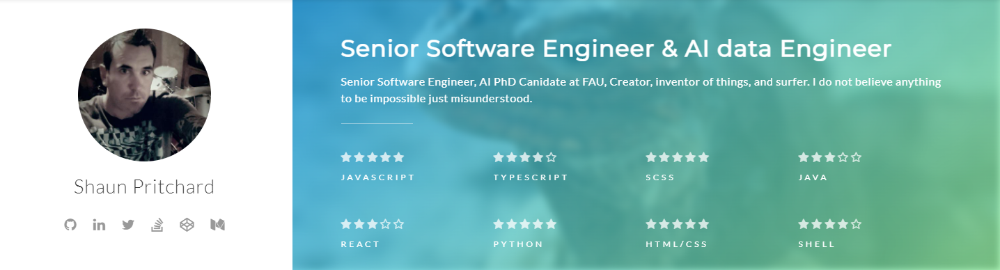

# Welcome to my portfolio!


### Senior Software Engineer / A.I Data Scientist: Shaun Pritchard
Welcome to my collective works and GitHub portfolio. I have compiled a portfolio of all of my programming, mathematics, artificial intelligence, and science accomplishments, including code projects, database architecture schemas, notebooks, published research, user experience design, video production, artificial intelligence models, and implementations that utilize my skills in full-stack development, data science and  artificial intelligence.


###### 📢 Conenct with me here!

[][website]
[][youtube]
[][twitter]
[][linkedin]
[][instagram]
[][facebook]


---

## Index
- [Interactive Web Applciation](#Interactive)
- [Work](#Work)
- [Projects](#Projects)
- [Professional](#Professional)
- [Research](#Research)
- [Design UX/UI](#Design)
- [Acedemic Work](#Acedemic)
- [Graduate Work](#Graduate)


----

## Interactive Web Applciation

GitHub is a great place for professionals to showcase their work, but I want to do something more unique and go beyond just generating a static website with basic links to my projects. I wanted to build an interactive environment to showcase my work. You can visit my interactive web application.

My interactive web app is more of a pipeline and data science lab uses a SPA with custom APIs that I developed that connects to my development servers, pipelines, and distributed network across K8 clusters.

To showcase my understanding and diversity of my skill sets and knowledge base, I also wanted to host my coursework thesis, research, and algorithms while openly making my work available for others to engage and interact with.

Note: Please check below to see if my interactive web app / dev-lab is up. I am constantly updating and adding new code and features.

***Please visit my interactive React web application portfolio here:***

> ### [Shaun Pritchard Portfolio Web App 2023](#)

<mark>```(Note: Web app is currently down for updating 2/3/2023)```</mark>

----

## Work

*If you are an employer or are seeking to utilize my skill sets please connect with me after viewing my resume at the link below; feel to reach out me*

### [Professional Inquiries go here](https://github.com/shaungt1/Shaun-Pritchard-Portfolio/blob/4f22fed7d7e0711ef1f6b1ebb0c77f72b77d1702/Professional/README.md)


## Projects

<p align="center">
<span>

</p>

> If you would like to see my  open source portfolio in a much more asthetic view please vist the link below.

<small> Note:```As of 2022-2023 I am currently contributing and working with the ChatGPT(3.5) Desktop Application team to bring chatGPT to (Windows,Mac, and Linux)```** </small>


### [Shaun Pritchard - Git Showcase](https://www.gitshowcase.com/shaungt1)
----

## Professional

> On the professional page, you will find a detailed work history, an updated resume, and additional information about the professional and enterprise software engineering and data engineering work I have or am currently undertaking.
### [Link to Professional and Resume](https://www.gitshowcase.com/shaungt1)

---

## Research
> A number of studies and research projects I am currently working on are included in the research section. Also included are white papers and abstractions of ket technologies of interest to me. I would like to invite you to read the research. However, please note that, unless you wish to cite the papers, contribute to the research you should be warned this is my intellectual property. I do not permit anyone to use the work I have done as their own without written signed permission. You are welcome to contribute to any of the research or projects listed in this repository by contacting me.

### [Link to my Research](https://github.com/shaungt1/Shaun-Pritchard-Portfolio/blob/013a4032851830f3cb2ba6199ad147fa2da81bb6/Reserach/README.md)

---

## Design UX/UI
> I consider myself to be a creative individual and have been for years. Since graduating from Tampa Tech with an AA in graphic arts in 2000, I've pursued design work and educated myself on UX/UI design principles. In my opinion, they are crucial to the development of any product. The following are several of my personal Figma UX/UI designs for professional and personal projects I have contributed to and designed.

### [Link to my Design Work](https://www.gitshowcase.com/shaungt1)
---
## Acedemic
> The section contains a compilation of my upper-level undergraduate and freelance work. For employers and business partners, or investors to review, I have provided files, scripts, apps, proofs, and abstracts. In addition, to demonstrate my abilities through academia in relation to the professional world. My academic and credited works will be organized into sub-folders within each folder.
### [Acedemic Work](https://github.com/shaungt1/Shaun-Pritchard-Portfolio/blob/7c5b928272145d75c3de649959a2938817119798/README.md)


## Graduate

> The section contains a compilation of my gradute master and Ph.D canidate work. For employers and business partners, or investors to review, I have provided files, scripts, apps, proofs, and abstracts. In addition, to demonstrate my abilities through academia in relation to the professional world. My academic and credited works will be organized into sub-folders within each folder.
### [Graduate Work](https://github.com/shaungt1/Shaun-Pritchard-Portfolio/blob/8c5dee1ac6c5971458102a47ed49410aef4a8c4d/Work%20AI%20Graduate/README.md)


---
###### 📢 Conenct with me here!

[][website]
[][youtube]
[][twitter]
[][linkedin]
[][instagram]
[][facebook]


<!-- dictonaries-->
[website]: https://shaunpritchard.org
[twitter]: https://twitter.com/ShaunPx1
[youtube]: https://www.youtube.com/channel/shaunpx1/
[instagram]: https://www.instagram.com/ShaunPx1/
[linkedin]: https://www.linkedin.com/in/shaun-pritchard/
[facebook]: https://www.facebook.com/shaunPX1